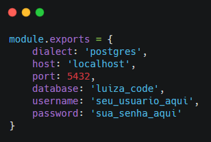

<h1 align="center"> Desafio Final Luiza Code - Omni Channel </h1>

## 📕 Índice

- [📋 Sobre](#Sobre)
- [🕹 Tecnologias](#Tecnologias)
- [🧑🏽‍💻 Iniciando o projeto](#Iniciando)
- [📝 Licença](#Licença)
- [🦸 Contatos](#Contatos)

<hr>


<!-- About -->

# Sobre

<p align="left"> 📡 Desenvolvimento de um serviço HTTP resolvendo a funcionalidade de Omni Channel do cliente. </p>

<!-- TECHNOLOGIES -->

# Tecnologias

- 🧩 **Tecnologias**
  - [Javascript](https://developer.mozilla.org/pt-BR/docs/Web/JavaScript)
  - [NodeJS](https://nodejs.org/en/)
  - [Postgres](https://www.postgresql.org/)

<hr>


<!-- TECHNOLOGIES -->

# Iniciando

### Pré-requisitos

- Node JS

  ```sh
  https://nodejs.org/en/
  ```

- Npm ou Yarn

  ```sh
  https://www.npmjs.com/
  ```

<hr>


### Instalação

1. Clonar o repositório:

   ```sh
   git clone https://github.com/CodeGirls-LuizaCode/backend.git
   ```

2. Instalar os pacotes:

   ```sh
   npm install
   ```

### Uso

1 - Para usar e testar a API, você precisa importar o arquivo db.sql da pasta ./db_postgres no Postgres.

2 - Alterar no arquivo ./config/database.js seu usuário e senha do banco de dados: <br /><br />



3 - Subir o servidor:

   ```sh
npm start
   ```


4 - Rodar os testes conforme indicado abaixo.

### Testes

Com a API em funcionamento, vamos rodar os testes que foram pedidos para o desafio via Insomnia (ou algum similar). Os endpoints obrigatórios estão em <i><b>destaque</b></i>. Seguem os testes:

| Endpoint                   | Operação HTTP | Explicação                                                   | Teste                                                        |
| -------------------------- | ------------- | ------------------------------------------------------------ | ------------------------------------------------------------ |
| <i><b>/usuarios</b></i>                   | POST          | Recebe um JSON com dados de um usuário e o inclui na base de dados. | http://localhost:3000/usuarios<br /><br />Enviar no body por JSON: (exemplo)<br />{<br />"nome":"Ana Maria Lopes",<br />"email":"amlopes@gmail.com",<br />"cpf":"354.785.894-53",<br />"data_nascimento":"1998-07-10",<br />"senha":"12345",<br />"EnderecoId": 3<br />}<br /><br />Retorna a frase: Usuário cadastrado com sucesso!<br />Objeto enviado com alguma informação faltando (ex: sem cpf):<br />retorna um status HTTP 400 - Bad Request. |
| /usuarios/login                   | POST          | Recebe um JSON com dados de login. | http://localhost:3000/usuarios/login<br /><br />Enviar no body por JSON: (exemplo)<br />{<br />"email": "amlopes@gmail.com",<br />  "senha": "12345"<br />}<br /><br />Retorna a frase: Login efetuado com sucesso<br />Objeto enviado com alguma informação errada:<br />retorna um status HTTP 400 - Bad Request. <br />Caso o usuário não possua cadastro: Retonar HTTP 404 - Not Found. |
| /usuarios/:id                   | PUT          | Recebe um JSON com dados para a atualização do usuário de acordo com o exemplo mostrado no cadastro. | http://localhost:3000/usuarios/:id<br /><br />Retorna a frase: Usuário atualizado com sucesso!<br />Na atualização de usuário o CPF não pode ser alterado, pois é um valor único. <br />Caso haja mudança de CPF o banco irá ignorar a requisição e manterá o valor do CPF inserido no cadastro. |
| /usuarios                   | GET          | Retorna todos os usuários cadastrados no banco. | http://localhost:3000/usuarios |
| /usuarios/:id                   | DELETE          | Remove o usuário referente ao ID inserido na URL. | http://localhost:3000/usuarios/:id<br /><br />Retorna a frase: Usuário deletado com sucesso! |
| /listas                     | GET          | Retorna todas as compras do banco em detalhes. | http://localhost:3000/listas |
| <b>/listas/compras/:usuarioId</b>                     | GET          | Retorna todas as compras finalizadas do usuário identificado no ID da URL. | http://localhost:3000/listas/compras/:usuarioId |
| /listas/carrinho/:usuarioId                     | GET          | Retorna todas as compras não finalizadas do usuário identificado no ID da URL. | http://localhost:3000/listas/carrinho/:usuarioId |
| <i><b>/listas</b></i>                     | POST          | Adiciona um produto à lista de compras do cliente. | http://localhost:3000/listas<br /><br />Enviar no body por JSON: (exemplo)<br />{<br />"ProdutoId": 5,<br />"UsuarioId": 4<br />}<br /><br />Retorna a frase: Produto adicionado a lista<br />Objeto enviado com alguma informação faltando (ex: sem o ID do produto): retorna um status HTTP 400 - Bad Request.<br />Lembrando: Só é possível adicionar um produto de cada tipo por lista.|
| <i><b>/listas/:listaId</b></i>                     | DELETE          | Remove um produto da lista de compras do cliente. | http://localhost:3000/listas/:listaId<br /><br />Retorna a frase: Produto removido da lista de compras!<br />Caso haja a tentativa de remover um produto de uma lista já finalizada retornará a mensagem: Não é possível excluir produtos de uma compra finalizada!|
| <i><b>/listas/finalizar-lista<i><b>                     | POST          | Finaliza a lista de compras do cliente. | http://localhost:3000/listas/finalizar-lista<br /><br />Enviar no body por JSON: (exemplo)<br />{<br />"UsuarioId": 3,<br />"LojaId": 3<br />}<br /><br />Retorna o número do pedido, valor total da compra e a frase: Lista finalizada com sucesso|
| <i><b>/listas/entrega</b></i>                     | POST          | Registra a retirada do pedido. | http://localhost:3000/listas/listas/entrega<br /><br />Enviar no body por JSON: (exemplo)<br />{<br />"numero_pedido": "25489"<br />}<br /><br />Retorna a mensagem: Produto foi retirado na loja(caso o cliente tenha passado o Id da loja física no ato da finalização da lista de compras) ou Produto foi entregue na casa do cliente (caso não tenha passado Id de loja física.). |
| <i><b>/lojas</b></i>                     | GET           | Retorna os detalhes de todas as lojas físicas disponíveis para retirada do produto. | http://localhost:3000/lojas                                  |
| <i><b>/produtos</b></i>                  | GET           | Retorna os detalhes de todos os produtos existentes no banco.                    | http://localhost:3000/produtos                               |
| /produtos/:produtoId                  | GET           | Retorna os detalhes de um produto específico identificado na URL.                    | http://localhost:3000/produtos/:produtoId                               |
| /categorias                  | GET           | Retorna todas as categorias existentes no banco.                    | http://localhost:3000/categorias                               |


  

## 👨🏽‍🚀 Deploy 

**__Heroku__**: 

[Code Girls](https://code-girls.herokuapp.com/docs/)

<!-- CONTACT -->

# Contatos

Célia Lopes - [Linkedin](https://www.linkedin.com/in/c%C3%A9lia-lopes-de-oliveira-49321678/) - oliveira.lopes.celia@gmail.com \
Islene Gomes - [Linkedin](https://www.linkedin.com/in/islene-dos-santos-gomes-fernandes-76899645/) - islenegomes@gmail.com \
Laoma Nogueira - [Linkedin](https://www.linkedin.com/in/laoma-nogueira/) - laomanogueira@gmail.com \
Milena Maganin - [Linkedin](https://www.linkedin.com/in/milenamaganin/) - mimaganin@gmail.com \
Sabrynna Lourenço - [Linkedin](https://www.linkedin.com/in/sabrynna-lourenco/) - limasabrynna03@gmail.com \
Thaís Minas - [Linkedin](https://www.linkedin.com/in/thaisminas/) - thais.2929@gmail.com

Link do projeto: [https://github.com/CodeGirls-LuizaCode/backend](https://github.com/CodeGirls-LuizaCode/backend)

